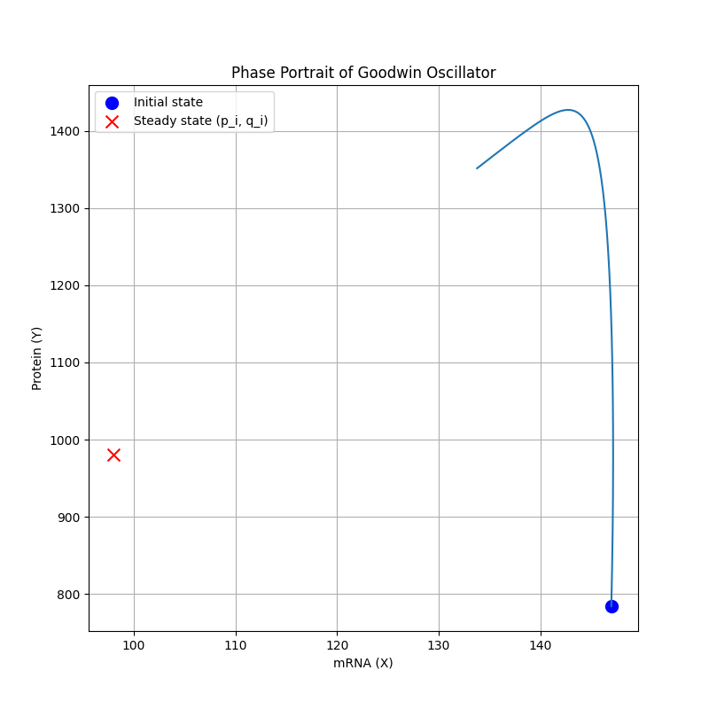
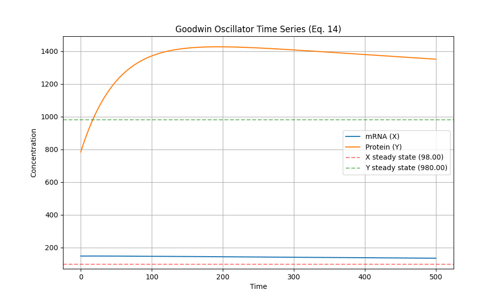
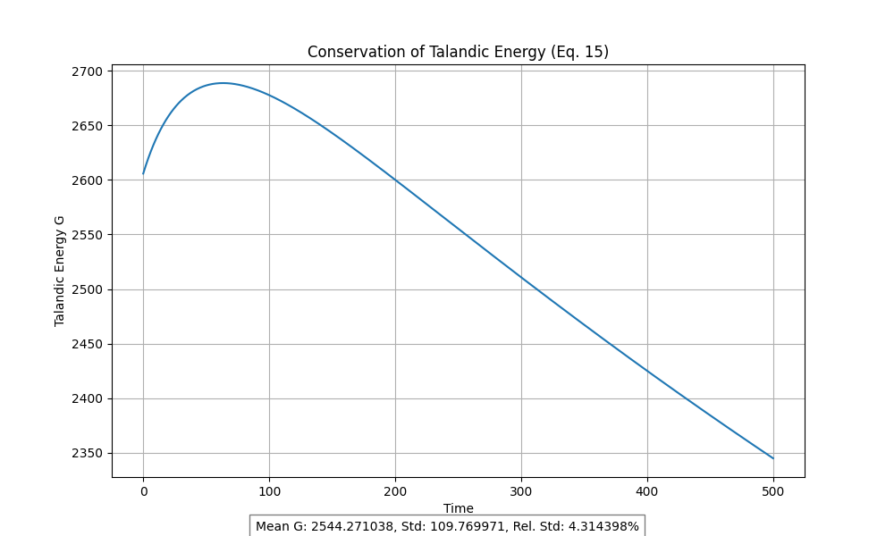

# Basic Epigenetic Oscillator Simulator 🧬

[](https://colab.research.google.com/github/Sakeeb91/Basic-Epigenetic-Oscillator/blob/main/notebooks/epigenetic_oscillator.ipynb)
[](https://mybinder.org/v2/gh/Sakeeb91/Basic-Epigenetic-Oscillator/main?filepath=notebooks%2Fepigenetic_oscillator.ipynb)
[](https://github.com/Sakeeb91/Basic-Epigenetic-Oscillator/blob/main/LICENSE)

<p align="center">
  
</p>

## 📌 Project Overview

This project implements a computational simulator for biological oscillations, specifically modeling the fundamental single negative feedback loop described by Goodwin's equations. The simulator demonstrates how complex biological rhythms (like circadian rhythms) can emerge from simple molecular interactions.

### Key Visualization Examples

<div align="center">
  <table>
    <tr>
      <td align="center"></td>
      <td align="center"></td>
    </tr>
    <tr>
      <td align="center"><b>Time Series Plot</b><br/>Shows oscillating mRNA and protein concentrations</td>
      <td align="center"><b>Talandic Energy Conservation</b><br/>Demonstrates conservation laws in the system</td>
    </tr>
  </table>
</div>

## 🔬 Scientific Background

The Goodwin oscillator is a canonical model in systems biology that explains how negative feedback can generate sustained oscillations in biological systems:

- **mRNA (X)** is produced and then translated to produce **Protein (Y)**
- **Protein (Y)** inhibits the production of **mRNA (X)**, creating a negative feedback loop
- Under the right parameters, this simple feedback mechanism generates sustained oscillations

The mathematical model follows these equations:

```
dX/dt = a_i / (A_i + k_i*Y) - b_i    (mRNA production with inhibition)
dY/dt = α_i*X - β_i*Y               (Protein production and degradation)
```

Where:
- X and Y are concentrations of mRNA and protein
- a_i, A_i, k_i, b_i, α_i, β_i are parameters controlling rates of synthesis, degradation, and inhibition

## 💻 Technical Highlights

This project demonstrates several key technical skills:

- **Scientific Computing**: Numerical solution of ordinary differential equations (ODEs)
- **Mathematical Modeling**: Implementation of biological feedback loops and oscillatory systems
- **Data Visualization**: Interactive plotting of complex dynamical systems
- **Scientific Analysis**: Verification of conservation laws and system properties
- **Software Engineering**: Clean code architecture with modular functions

### Technologies Used

- **Python**: Core implementation language
- **NumPy/SciPy**: Scientific computing and ODE solving
- **Matplotlib**: Data visualization
- **Jupyter**: Interactive notebooks for exploration
- **ipywidgets**: Interactive parameter controls

## 🚀 Interactive Features

The simulator includes:

- **Interactive Parameter Exploration**: Adjust key biological parameters and observe effects in real-time
- **Multiple Visualization Types**: Time series, phase portraits, and conservation analysis
- **Parameter Studies**: Systematic exploration of parameter effects on system dynamics
- **Conservation Verification**: Analysis of Talandic Energy conservation

## 🔧 Usage Options

### 1. Run Online (No Installation Required)

- **Google Colab**: Click the [](https://colab.research.google.com/github/Sakeeb91/Basic-Epigenetic-Oscillator/blob/main/notebooks/epigenetic_oscillator.ipynb) badge
- **Binder**: Click the [](https://mybinder.org/v2/gh/Sakeeb91/Basic-Epigenetic-Oscillator/main?filepath=notebooks%2Fepigenetic_oscillator.ipynb) badge
- **GitHub Codespaces**: Click the green "Code" button on the repository and select "Open with Codespaces"

### 2. Run Locally

```bash
# Clone the repository
git clone https://github.com/Sakeeb91/Basic-Epigenetic-Oscillator.git
cd Basic-Epigenetic-Oscillator

# Install dependencies
pip install -r requirements.txt

# Run the simulation
python src/epigenetic_oscillator.py

# Or open the notebook
jupyter notebook notebooks/epigenetic_oscillator.ipynb
```

## 📊 Sample Results

The simulator demonstrates several key biological phenomena:

1. **Sustained Oscillations**: The system shows spontaneous, self-sustaining oscillations without external forcing
2. **Phase Relationships**: Clear time delays between mRNA and protein peaks, mimicking real biological systems
3. **Parameter Sensitivity**: Changing parameters affects oscillation amplitude, period, and stability
4. **Conservation Laws**: The Talandic Energy remains constant, verifying the mathematical properties

## 📖 Further Reading

- Goodwin, B.C. (1965). Oscillatory behavior in enzymatic control processes. Advances in Enzyme Regulation, 3, 425-438.
- Gonze, D. (2021). The Goodwin model: Behind the Hill function. PLOS Computational Biology, 17(1), e1008691.

## 📄 License

This project is open source and available under the MIT License. 